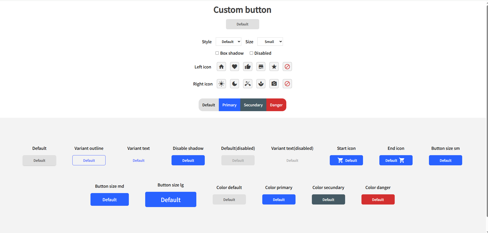

<div align="center">

# button-challenge

[](https://reactjs.org/)
[](https://devchallenges.io/)
[](LICENSE)

**🎨 A fully customizable React button component — built for the devChallenges.io competition 🏆**

[View Challenge](https://devchallenges.io/) · [Live Demo](#)

</div>

---

## Preview



## Overview

This project was built as a submission to the **Reusable Button Component** challenge on [devChallenges.io](https://devchallenges.io/). It features a live interactive playground to configure and preview the button in real time, plus a showcase of all available variants.

The `Button` component supports 4 colors, 3 sizes, 3 variants, left/right icons, box shadow, and disabled state — all controlled through clean props.

## ✨ Features

- 🎨 **4 color variants** — Default, Primary, Secondary, Danger
- 📐 **3 sizes** — `sm`, `md`, `lg`
- 🖼️ **3 style variants** — Default, Outline, Text
- 🔲 **Box shadow** toggle
- 🔕 **Disabled** state
- 🔣 **Material Icons** support — left and/or right icon
- 🖱️ **Live playground** — interactive UI to configure and preview the button

## 🚀 Quick Start

```bash
# Install dependencies
npm install

# Start the dev server
npm start
```

Open [http://localhost:3000](http://localhost:3000) to use the interactive playground.

## 🔧 Button Component API

```jsx
import Button from './components/Button';

<Button
  variant="default"     // "default" | "outline" | "text"
  color="primary"       // "default" | "primary" | "secundary" | "danger"
  size="md"             // "sm" | "md" | "lg"
  boxShadow={true}      // boolean
  disabled={false}      // boolean
  leftIcon="home"       // Material Icon name (optional)
  rightIcon="shopping_cart" // Material Icon name (optional)
/>
```

### Props

| Prop | Type | Values | Description |
|------|------|--------|-------------|
| `variant` | `string` | `default`, `outline`, `text` | Visual style of the button |
| `color` | `string` | `default`, `primary`, `secundary`, `danger` | Color theme |
| `size` | `string` | `sm`, `md`, `lg` | Button size |
| `boxShadow` | `boolean` | `true`, `false` | Adds drop shadow |
| `disabled` | `boolean` | `true`, `false` | Disables interaction |
| `leftIcon` | `string` | Any [Material Icon](https://fonts.google.com/icons) name | Icon before label |
| `rightIcon` | `string` | Any [Material Icon](https://fonts.google.com/icons) name | Icon after label |

## 🏗️ Built With

- [React 17](https://reactjs.org/)
- [SCSS](https://sass-lang.com/)
- [Material Icons](https://fonts.google.com/icons)
- [Create React App](https://create-react-app.dev/)

## 🏆 Challenge

This project is a solution to the [Reusable Button Component](https://devchallenges.io/) challenge on **devChallenges.io** — a platform for developers to practice frontend skills through real-world UI challenges.

---

<div align="center">
  Made with ❤️ for <a href="https://devchallenges.io/">devChallenges.io</a>
</div>
